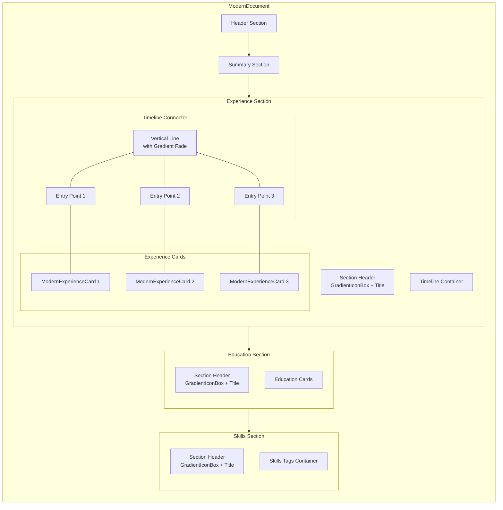
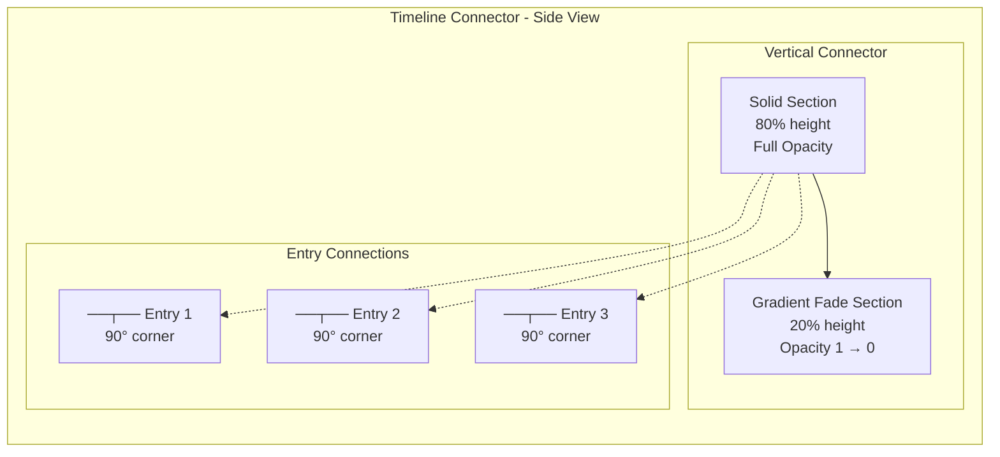
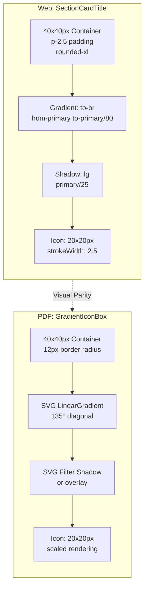
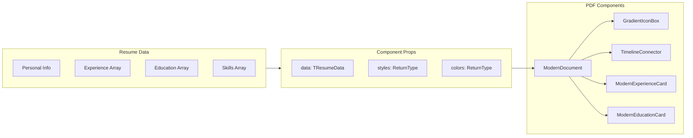

# ModernDocument Component Architecture

## Component Hierarchy



## Timeline Connector Detail



## Section Header Icon Structure



## Style Value Mapping

| Property | Web (Tailwind) | PDF (react-pdf) |
|----------|---------------|-----------------|
| Container Size | `size-10` (40px) | `width: 40, height: 40` |
| Padding | `p-2.5` (10px) | Centered with flex |
| Border Radius | `rounded-xl` (~16px) | `borderRadius: 12` (PDF scale) |
| Gradient | `bg-gradient-to-br` | `LinearGradient x1=0,y1=0,x2=1,y2=1` |
| Shadow | `shadow-lg shadow-primary/25` | SVG filter or opacity layer |
| Icon Size | `size-5` (20px) | `width: 20, height: 20` |
| Gap | `gap-3` (12px) | `gap: 12` |

## Data Flow



## Timeline Layout Dimensions

```
┌─────────────────────────────────────────────────────────────┐
│ Page Margin (32px)                                          │
│  ┌──────────────────────────────────────────────────────┐   │
│  │ Section Header                                       │   │
│  │ ┌──────┬─────────────────────┐                       │   │
│  │ │ Icon │ Title               │                       │   │
│  │ │ 40px │                     │                       │   │
│  │ └──────┘                     │                       │   │
│  └──────────────────────────────────────────────────────┘   │
│                                                             │
│  ┌──────────────────────────────────────────────────────┐   │
│  │ Timeline Container                                   │   │
│  │ ┌────────┬─────────────────────────────────────────┐ │   │
│  │ │        │ ┌─────────────────────────────────────┐ │ │   │
│  │ │   ●────┤ │ Experience Card 1                   │ │ │   │
│  │ │   │    │ │                                     │ │ │   │
│  │ │   │    │ └─────────────────────────────────────┘ │ │   │
│  │ │   │    │                                       │ │   │
│  │ │   ●────┤ ┌─────────────────────────────────────┐ │ │   │
│  │ │   │    │ │ Experience Card 2                   │ │ │   │
│  │ │   │    │ │                                     │ │ │   │
│  │ │   │    │ └─────────────────────────────────────┘ │ │   │
│  │ │   │    │                                       │ │   │
│  │ │   ●────┤ ┌─────────────────────────────────────┐ │ │   │
│  │ │   │    │ │ Experience Card 3                   │ │ │   │
│  │ │  ╱     │ │                                     │ │ │   │
│  │ │ ╱      │ └─────────────────────────────────────┘ │ │   │
│  │ │╱       │                                       │ │   │
│  │ ├────────┘                                       │ │   │
│  │ │ Gradient Fade (transparent)                    │ │   │
│  │ └────────────────────────────────────────────────┘ │   │
│  └──────────────────────────────────────────────────────┘   │
│                                                             │
│  Timeline Line: 2px width                                   │
│  Connection Point: 8px horizontal from line                 │
│  Entry Point Marker: 6px diameter                           │
│  Card Offset from line: 20px                                │
└─────────────────────────────────────────────────────────────┘
```

## Key Implementation Notes

1. **Sharp Corners**: Use SVG `Path` with explicit line commands instead of `Rect` with rounded corners
2. **Gradient Fade**: Linear gradient with opacity stops from 1 to 0 over last 20-30% of line
3. **Dynamic Height**: Timeline height calculated based on number of experience entries
4. **Icon Consistency**: All section icons use same GradientIconBox component with different colors
5. **Color Palette**: Icons use section-specific colors (experience, education, skills from palette)
